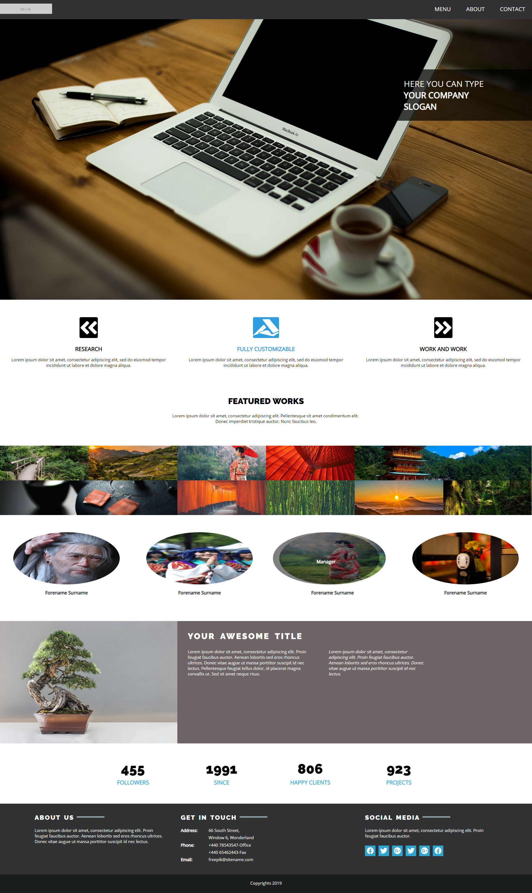
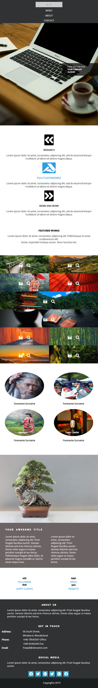

# Transform To Responsive Webpage
> Adjust present webpage to one which is responsive.

## Check Here ==> https://jakubfolta.github.io/Bootcamp-TransformToResponsivePage/

## Technologies
* HTML5, CSS3

## Status
Project is finished. 

## Full Screen

## Responsive Webpage

## Sources
This project was created while going through WebDeveloper Kodilla Bootcamp. 

## Contact
Created by Jakub Folta [@betterlifewisdom](https://www.betterlifewisdom.com/) - feel free to contact me! 
[Facebook](https://www.facebook.com/jakub.folta.58) - or check my fb account and send me a message!
